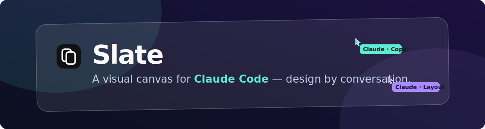
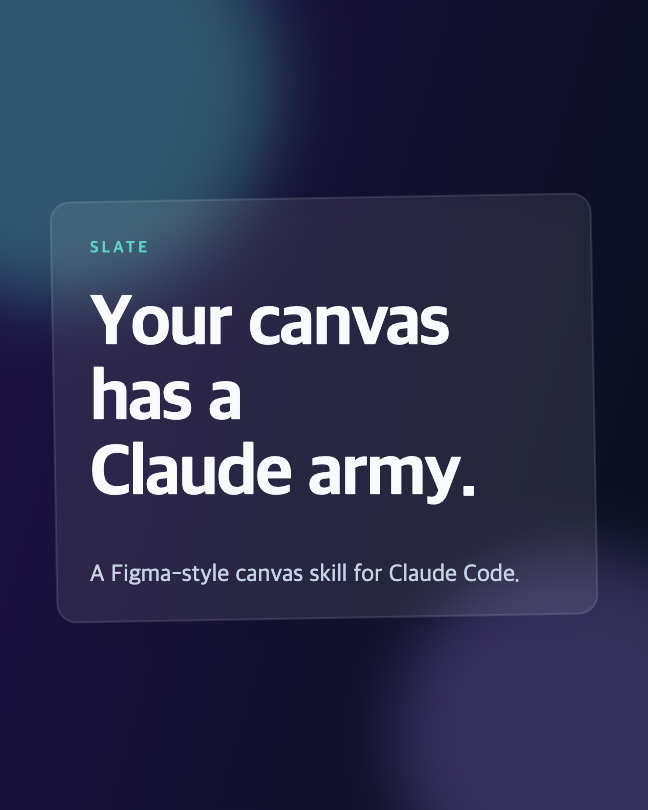
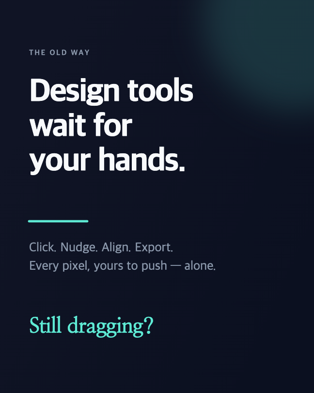
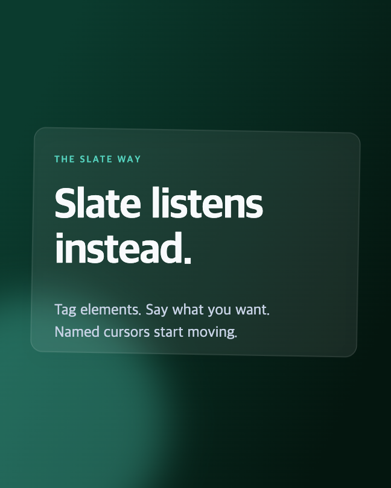
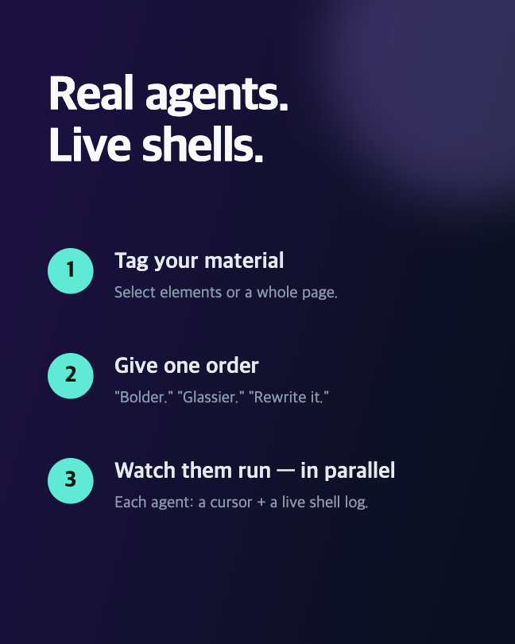
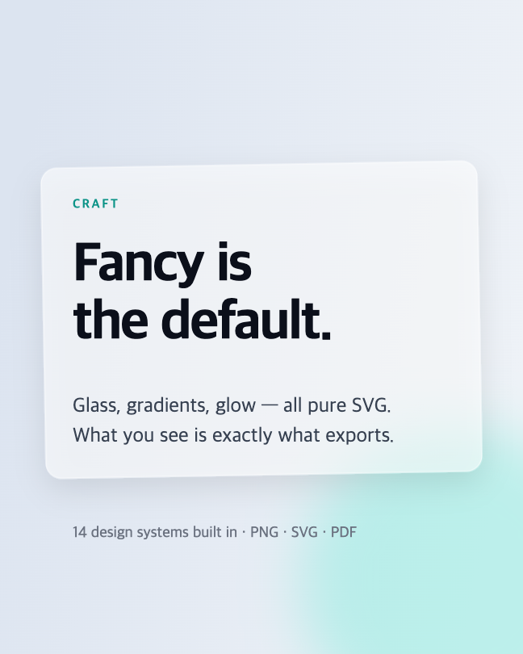
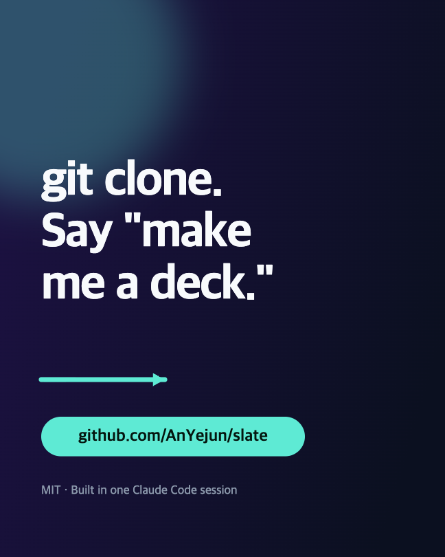

<p align="center"></p>

<p align="center">
  <a href="README.md">English</a> · <b>한국어</b>
</p>

# Slate

**Claude Code에 카드뉴스·캐러셀·피겨 편집기를 더해주는 오픈소스 Skill입니다.**

Slate는 디자인이 담긴 폴더를 Claude Code 미리보기 패널 안의 Figma 스타일 라이브
캔버스로 열어줍니다. 사용자는 시각적으로 배치하고 편집하고, Claude는 같은 파일을
편집하며, 그 변화가 실시간으로 화면에 반영됩니다. 도움이 필요할 때는 요소를 선택해
요청하면, Claude 서브에이전트가 그 부분을 수정하는 동안 사용자는 계속 작업할 수
있습니다.

디자인 전체가 하나의 JSON 파일이라 어떤 것도 잠겨 있지 않습니다. 캔버스에 보이는
그대로 PNG·SVG·PDF로 내보내집니다.

---

## Slate로 만든 예시

아래 슬라이드는 Slate 캔버스에서 디자인하고 Slate의 내보내기로 렌더링한
것입니다. 소스는 [`examples/slate-promo/`](examples/slate-promo/cards.json)에
있습니다 — Slate에서 열어 그대로 수정해 보세요.

<table>
  <tr>
    <td></td>
    <td></td>
    <td></td>
  </tr>
  <tr>
    <td></td>
    <td></td>
    <td></td>
  </tr>
</table>

---

## 주요 기능

- **양방향 실시간 동기화.** 덱 전체가 하나의 `cards.json`입니다. 캔버스에서
  드래그하고 입력하면, Claude가 파일을 편집하고, 둘이 항상 동기화됩니다. 채팅으로
  작업하든 보드에서 Claude에게 지시하든 같은 파일, 같은 결과입니다.
- **태그하고 요청하기.** 요소나 페이지를 선택하면 컴포저에 칩으로 붙습니다. 수정을
  요청하면 서브에이전트가 정확히 그 소재만 처리합니다. 요청을 여러 번 보내면
  병렬로 실행되며, 각 에이전트는 자기 실행 셸 로그를 실시간으로 보여줍니다.
- **라이브 커서.** 모든 편집이 diff되어 이름표가 달린 커서로 캔버스 위를 움직이며
  표시됩니다. 여러 에이전트가 동시에 작업하는 모습도 볼 수 있습니다.
- **팬시가 기본.** 글래스모피즘 스타일 엔진(그라디언트·블러·드롭섀도·투명도)을
  순수 SVG로 렌더링하므로, 내보낸 결과가 화면과 정확히 일치합니다.
- **14종 디자인 시스템 내장.** glass · apple · linear · vercel · stripe · figma ·
  raycast · notion · spotify · nike · theverge · framer · cal · slate. 하나를
  고르면 모든 편집이 그 시스템을 따릅니다. (12종은
  [awesome-design-md](https://github.com/VoltAgent/awesome-design-md), MIT)
- **제대로 된 에디터.** 모든 슬라이드를 한 Figma 스타일 보드에, 드래그로 순서를
  바꾸는 레이어 패널, 다중 선택·마퀴, 스마트 정렬 가이드, 회전, 줌, 드래그로 선긋기,
  이미지 드롭, 언두/리두, 복원 가능한 버전 히스토리.
- **깔끔한 내보내기.** PNG·SVG·PDF — 하나의 직렬화기를 공유하므로 보이는 그대로
  나옵니다.

## 시작하기

```bash
git clone https://github.com/AnYejun/slate.git ~/.claude/skills/slate
```

Claude Code를 열고 시각적인 작업을 요청하세요 — 예: *"카드뉴스 5장 만들어줘"*,
*"논문에 넣을 피겨 하나 만들어줘"*. Claude가 워크스페이스를 준비하고 미리보기
패널(또는 `localhost:5173` 전체화면)에 에디터를 열어, 함께 편집하게 됩니다.

**요구사항.** Node 18+. 보드에서 서브에이전트를 실행하려면
[Claude Code CLI](https://claude.com/claude-code)에 한 번 로그인해 두세요
(`claude` → `/login`). 실행은 별도 API 키가 아니라 Claude 구독으로 처리됩니다.
CLI가 없으면 보드가 요청을 복사해 주어 채팅에 붙여넣어 쓸 수 있습니다.

## 동작 방식

```
요소 태그 ──► POST /api/agents/run ──► 요청마다 claude -p
    ▲                                   (Read / Edit / Write, 샌드박스)
    │                                            │
라이브 캔버스 ◄── 파일 diff → 이름표 커서 ◄── 에이전트가 cards.json 편집
(React + Vite)     셸 출력 → 워크보드                └─ 자동 스냅샷, 복원 가능
```

`cards.json`이 단일 진실원본입니다. 개발 서버가 이 파일을 감시하며 변경마다
diff하고, 그 변경을 수행한 에이전트에 귀속시키고, 히스토리용으로 스냅샷을 남기고,
커서와 셸 출력을 보드로 스트리밍합니다. 화면 SVG 직렬화기가 곧 내보내기 엔진이라
캔버스와 결과물이 동일합니다.

## 참고

- **안전성.** 서브에이전트는 `Read/Edit/Write`만, 워크스페이스 디렉터리 안에서,
  타임아웃과 격리된 환경으로 실행됩니다. 외부 편집은 항상 먼저 스냅샷되며 어떤
  버전이든 한 번의 클릭으로 복원할 수 있습니다.
- **채팅도 그대로.** Slate는 평범한 Claude Code 스킬이라 언제든 채팅으로 Claude에게
  요청할 수 있습니다. 보드는 설명보다 가리키는 편이 쉬울 때를 위한 것입니다.
- **한글 입력.** IME 조합을 처리하므로 조합 중 Enter로 잘못 전송되지 않습니다.

## 크레딧 & 라이선스

MIT ([LICENSE](LICENSE)). [Cal Sans](https://github.com/calcom/sans)(SIL OFL 1.1)와
[VoltAgent/awesome-design-md](https://github.com/VoltAgent/awesome-design-md)(MIT)의
디자인 시스템을 포함합니다.
